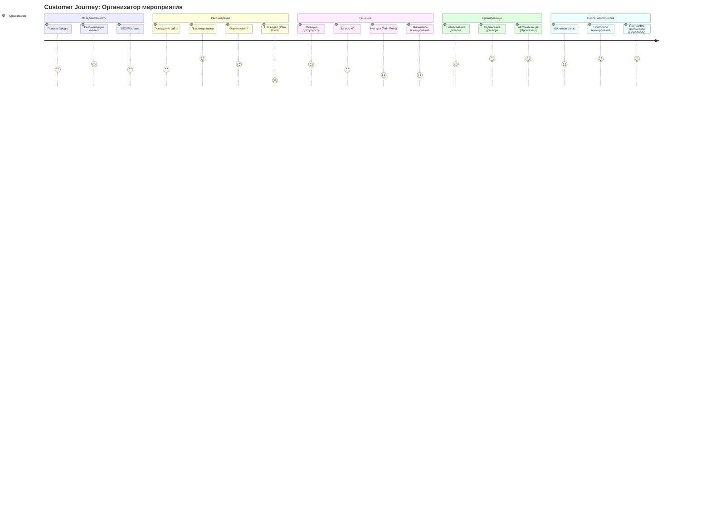
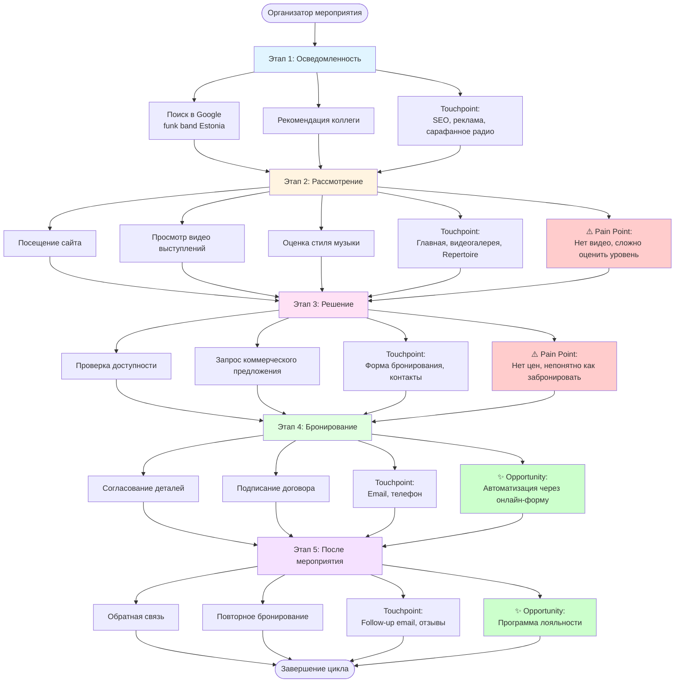
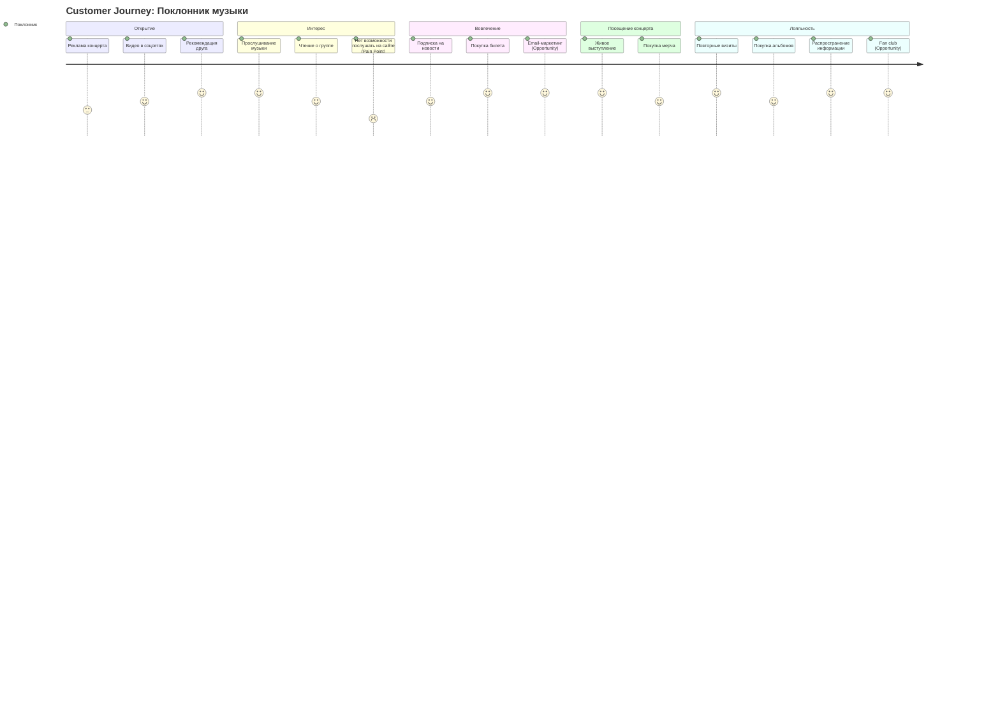
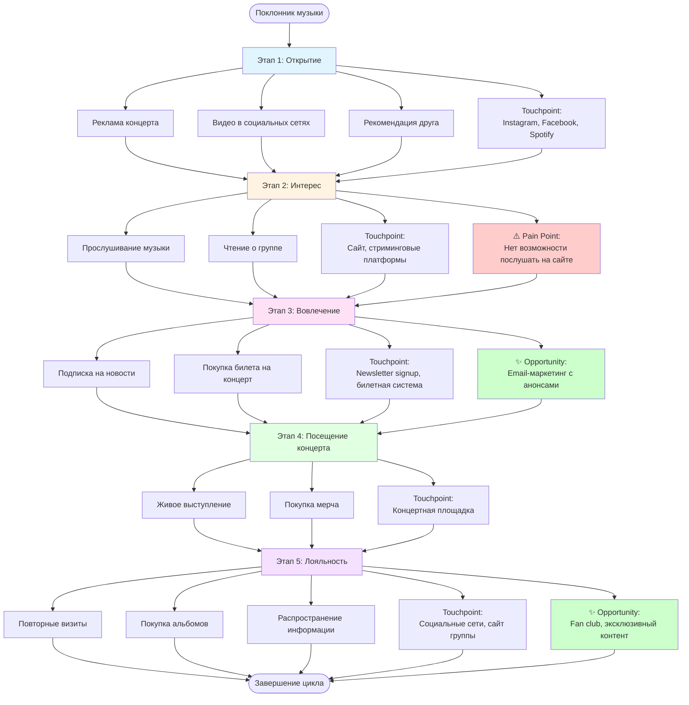

```mermaid
gantt
    title Customer Journey Timeline: Поклонник музыки
    dateFormat X
    axisFormat %s
    
    section Открытие
    Реклама / Видео / Рекомендация    :0, 1
    section Интерес
    Прослушивание музыки              :1, 2
    Чтение о группе                   :2, 1
    section Вовлечение
    Подписка на новости               :3, 1
    Покупка билета                    :4, 1
    section Посещение концерта
    Живое выступление                 :5, 2
    Покупка мерча                     :6, 1
    section Лояльность
    Повторные визиты                  :7, 2
    Покупка альбомов                  :8, 1
    Распространение информации        :9, 1
```

# Customer Journey Map: Организатор мероприятия

## Детальная диаграмма с touchpoints

## Временная шкала Customer Journey

```mermaid
gantt
    title Customer Journey Timeline: Организатор мероприятия
    dateFormat X
    axisFormat %s
    
    section Осведомленность
    Поиск в Google / Рекомендация     :0, 1
    section Рассмотрение
    Посещение сайта                    :1, 2
    Просмотр видео / Оценка            :2, 3
    section Решение
    Проверка доступности               :3, 1
    Запрос КП                          :4, 2
    section Бронирование
    Согласование деталей               :6, 3
    Подписание договора                :9, 2
    section После мероприятия
    Обратная связь                     :11, 2
    Повторное бронирование             :13, 1
```

---

# Customer Journey Map: Поклонник музыки

## Детальная диаграмма с touchpoints

## Временная шкала Customer Journey

